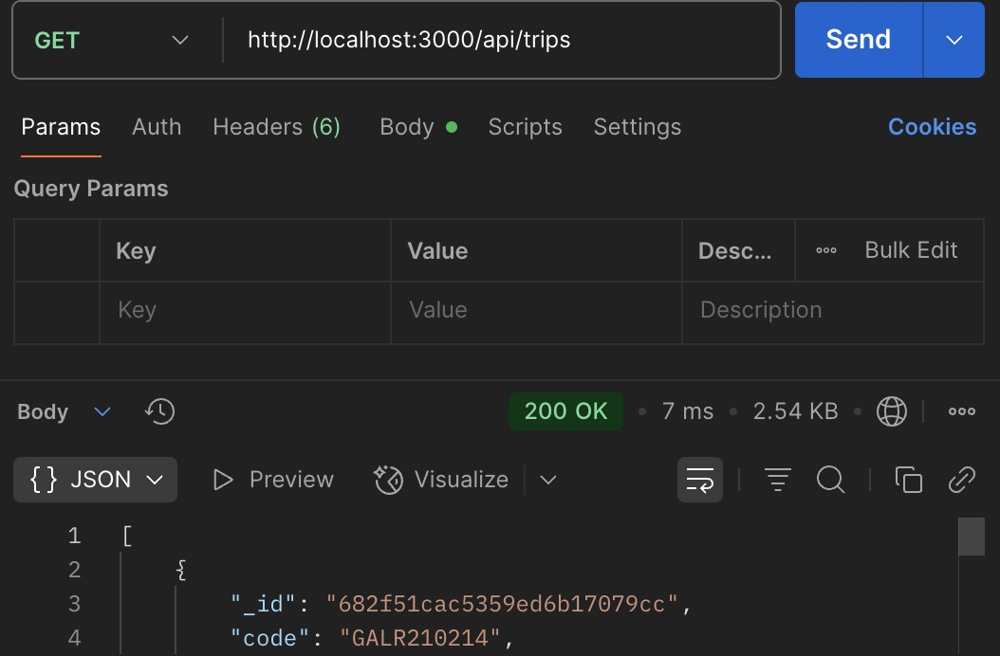

# Travlr Full Stack App

## Architecture
<p align="left">
  
In this project I used traditional Express-based server-side rendering and Angular-based frontend development. The Express app used HTML, CSS, and JavaScript along with Handlebars to render views on the server. This means that every new page required a reload aswell as a new HTTP request. On the other hand, the Angular Single Page Application rendered everything on the client side which allowed for dynamic updates without the need for a full reload. Angular offers more features such as two way data binding, client side routing, and modular components and services. This made the application much more responsive. The backend used MongoDB, a NoSQL database because its document based structure works well with JavaScript objects in a full stack JavaScript ecosystem such as this one. It allowed flexibility in the schema and faster iteration during development.
</p>

## Functionality
<p align="left">
  
JSON is a data interchange format that is separate from JavaScript, but can be parsed by it. In my app JSON was used to send and receive data between the Angular frontend and the Express backend. The Angular services handled the requests and transformed the API JSON responses into usable frontend objects. During development I had refactored the Angular UI by extracting shared logic into reusable components such as TripCardComponent. I also modularized services for trip and authentication logic which improved the maintainability and made code more reusable. These reusable UI components and services allowed me to build consistent and scalable views more efficiently during developement. 
</p>

## Testing

I tested my API endpoints using Postman and the browser developer tools. The GET endpoints were tested by retrieving trip data from MongoDB and PUT requests were tested by editing trips with Angular’s reactive form. Console logs also helped confirm that the data was fetched and updated correctly. In order to ensure security, I implemented an HTTP Interceptor in Angular to attach JWTs to each request. This allowed PUT requests to go through only when the user was authenticated. I confirmed this behavior by checking for failed requests in Postman, when an admin user isn't authenticated, and verifying the data in MongoDB Compass. I also tested edge cases like invalid trip codes and attempted edits while logged out. Error handling in the Angular UI also helped for user's, and myself, to understand why a request may or may not be working.

## Testing screenshots
<table>
  <tr>
    <td></td>
    <td></td>
    <td></td>
  </tr>
  <tr>
    <td></td>
    <td></td>
    <td></td>
  </tr>
</table>


## Running the App

To run the full stack application locally:

1. **Clone the repository**:
   ```bash
   git clone https://github.com/TyWheelerSNHU25/cs465-fullstack
   cd travlr
   ```

2. **Start the Express server**:
   ```bash
   npm install
   npm start
   ```
   The server will run at `http://localhost:3000`

3. **Start the Angular Admin App**:
   ```bash
   cd app_admin
   npm install
   ng serve
   ```
   The Angular frontend will run at `http://localhost:4200`

## Reflection

This course has taught me how to design and implement a secure full stack application from beginning to end. Throughout this project I learned the value of using modern frontend frameworks, such as Angular, in order to enhance the user experience, and how to structure code for modularity and reuseability, all while following best coding practices. I also gained a strong understanding of RESTful API design, secure authentication practices, and how to test for all aspects across the stack. These skills are directly applicable to real world development and have helped me build a more complete portfolio for my future career aspirations. I now feel much more confident in pursuing full stack development roles in both frontend and backend heavy environments.
